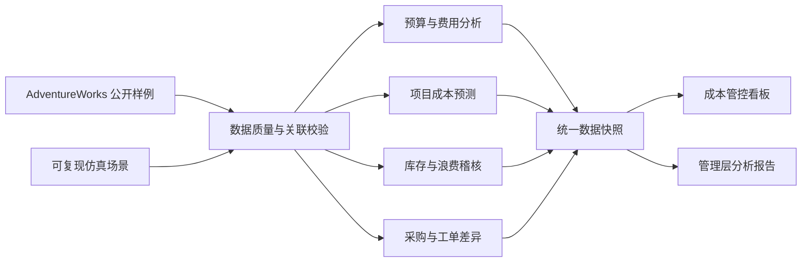

# 供应链成本分析与制造费用管控

这是一个面向制造费用分析、项目成本管理、库存稽核和采购降本岗位的求职作品集项目。项目模拟制造企业月度成本管理流程，将预算、费用台账、生产工单、采购订单、库存盘点、现场浪费和项目进度数据整合到同一套分析框架中，最终输出管理层分析报告和交互式成本管控看板。

项目不是单纯“画几张图”，而是完整实现了从数据准备、质量校验、指标定义、异常识别到管理汇报的端到端流程。

## 项目要解决的问题

制造企业的成本数据通常分散在预算表、费用台账、采购订单、工单、库存和项目台账中。本项目围绕以下管理问题展开：

1. 全年费用是否在预算范围内？哪些月份、部门和费用科目已经出现超预算预警？
2. 哪些项目的成本消耗快于实际进度，预计完工时可能超出目标成本？
3. 哪些库位账实差异较大，需要优先复盘盘点、扫码和出入库流程？
4. 报废、返工、材料超耗等现场浪费主要发生在哪里，损失金额如何量化？
5. 哪些物料采购价格偏离标准成本，应进入采购复核清单？
6. 如何把上述结果整理为管理层可以直接阅读的月度经营分析材料？

## 我完成了什么

### 1. 建立可复现的数据基础

- 整理 Microsoft AdventureWorks 的 14 张制造、采购、工单和库存教学样例表，共约 27 万条记录。
- 对表结构、主键、字段宽度和 15 组关联关系进行校验。
- 使用固定随机种子 `20260922` 生成预算、费用台账、库存实盘、项目成本和浪费稽核场景。
- 在数据中保留来源分类，明确区分公开教学样例与仿真场景，避免把仿真结果包装成真实企业绩效。

### 2. 搭建制造成本指标体系

| 分析主题 | 核心指标或方法 | 管理用途 |
| --- | --- | --- |
| 预算管控 | 预算执行率、预算差异、红色预警 | 定位超预算月份、部门和费用科目 |
| 项目成本 | 成本消耗率、预计完工成本、预计超支、风险分级 | 在项目完工前暴露成本风险 |
| 库存稽核 | 账实相符率、数量差异、差异绝对额 | 确定优先抽盘库位 |
| 制造浪费 | 报废损失、返工、材料超耗、设备停机 | 支持现场浪费复盘和改善 |
| 采购降本 | 采购价格差异（PPV）、物料差异排名 | 形成采购价格复核清单 |
| 工单成本 | 计划成本、实际成本、工单成本差异 | 分析制造过程成本偏差 |

### 3. 实现数据处理和异常规则

- 使用 Python 和 Pandas 完成多表读取、字段标准化、关联、分组汇总和指标计算。
- 预算预警下沉到“月份 × 部门 × 费用科目”粒度，而不是只看全年总额。
- 使用“累计实际成本 ÷ 完成进度”估算项目完工成本，并结合成本消耗率与物理进度进行风险分级。
- 将报废数量与产品标准成本关联，估算不同报废原因对应的损失金额。
- 计算采购价格与标准成本的差异，并排除 `6,892` 条标准成本为 0、缺少有效比较基准的采购记录。
- 为核心口径编写自动测试，覆盖预算、报废、库存、采购和项目成本计算。

### 4. 输出管理层报告与交互式看板

- 制造成本管控看板：集中展示预算执行、超预算预警、项目风险、盘点差异、浪费结构、报废原因和采购价格差异。
- 成本与风险分析报告：以“发现—原因—建议”的方式组织结果，方便经营分析会或面试展示。
- 两份成果均导出为离线 HTML，下载后双击即可查看，不需要部署服务器或连接数据库。

## 分析流程



## 当前分析结果

> 以下结果用于展示分析方法。预算、盘点、项目和浪费数据属于仿真场景；AdventureWorks 也是虚构教学数据，不代表任何真实企业的经营表现。

- 年度预算约 `1.335 亿元`，实际费用约 `1.266 亿元`，整体预算执行率为 `94.8%`。
- 总额未超预算，但在“月份 × 部门 × 费用科目”层面发现 `26` 个红色预警组合，说明总额可控不等于过程没有风险。
- `10` 个项目中有 `4` 个被识别为高风险，正向预计超支合计约 `184.7 万元`。
- 库存盘点账实相符率为 `94.2%`，盘点差异绝对额约 `2.39 万元`，可进一步按库位确定抽盘优先级。
- AdventureWorks 样例中的报废损失估值约 `36 万元`，损失最高的已记录原因是 `Color incorrect`。
- 采购价格差异分析将 `HL Mountain Tire` 等物料列为优先复核对象，但不在缺少合同和市场行情证据时直接归因。

这些结果对应的管理动作包括：复核红色预算组合、重点跟踪高风险项目、提高低相符率库位的抽盘频率、针对主要报废原因开展现场分析，以及对高采购价差物料检查合同与供应商报价。

## 主要交付物

| 交付物 | 内容 | 位置 |
| --- | --- | --- |
| 制造成本管控看板 | KPI、趋势图、异常排名和明细表 | [`output/制造成本管控看板.html`](output/制造成本管控看板.html) |
| 制造成本分析报告 | 执行摘要、关键发现、风险解释和数据边界 | [`output/制造成本分析报告.html`](output/制造成本分析报告.html) |
| 数据处理程序 | 仿真数据生成、成本指标计算和快照构建 | [`src/`](src/) |
| 指标测试 | 核心计算口径和可复现性检查 | [`tests/`](tests/) |
| 数据来源说明 | 表结构、下载来源和质量检查结果 | [`docs/adventureworks_sources.md`](docs/adventureworks_sources.md) |
| 看板设计规范 | KPI 定义、图表设计和业务边界 | [`docs/manufacturing_dashboard_spec.md`](docs/manufacturing_dashboard_spec.md) |

## 如何查看成果

1. 克隆或下载本仓库。
2. 打开 `output` 文件夹。
3. 双击 `制造成本管控看板.html` 或 `制造成本分析报告.html`。

离线文件已经内嵌页面运行环境和数据快照，不需要安装 Python 或 Node.js。

## 运行与验证

安装依赖：

```bash
python -m pip install -r requirements.txt
```

重新生成分析快照：

```bash
python -m src.build_reviewed_snapshot
```

运行核心口径测试：

```bash
python -m unittest discover -s tests -v
```

当前测试覆盖预算执行及预警、工单成本与报废损失、库存与采购价差、项目完工成本预测，以及仿真数据的可复现性。

## 技术栈

- Python、Pandas、NumPy
- JavaScript、React 数据应用
- CSV、JSON 数据建模
- 单元测试与数据质量验证
- 交互式图表、数据表和离线 HTML 报告

## 项目结构

```text
data/raw/        AdventureWorks 公开原始数据
data/generated/  可复现的财务与稽核仿真数据
data/processed/  标准化结果和成本分析明细
src/             Python 数据生成、处理与指标计算
tests/           核心口径和边界测试
docs/            数据来源、指标定义与看板规范
dashboard/       制造成本管控看板源码
report/          管理层分析报告源码
output/          可直接打开的离线交付文件
```

## 与目标岗位的匹配

这个项目集中展示了两个岗位共同要求的能力：预算与费用分析、成本核算、动态预警、库存账实核对、采购成本分析、跨表数据处理、管理报告输出，以及把异常转化为可执行改进建议。面试时可以围绕“指标如何定义、数据如何校验、为什么这样设置预警、发现异常后如何推动业务复核”展开讲解。
