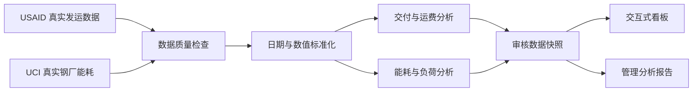

# 真实供应链成本与制造能耗分析

这是一个面向制造费用、项目成本、供应链运营和采购降本岗位的求职作品集。项目使用两份真实公开数据：USAID 国际医疗供应链发运明细和 UCI 钢铁企业 15 分钟能耗记录。

项目完成了从数据下载、质量检查、字段标准化、指标计算、异常定位到报告和看板交付的完整流程。原来的 AdventureWorks 虚构教学数据和仿真预算数据已退出主看板、主报告和主指标。

## 项目做了什么

### 1. 采购与物流分析

- 处理 10,324 条 USAID 真实发运明细，覆盖 43 个目的国。
- 计算行项目货值、准时交付率、延迟天数、已知运费及运费覆盖率。
- 按年度、运输方式、目的国和制造地点下钻，定位交付风险和业务暴露。
- 将运费字段中的数值、“已含在货值”、“另行开票”和引用其他单据区分处理，不把非数值状态当作 0。

### 2. 制造能耗分析

- 处理 35,040 条韩国钢铁企业真实 15 分钟用电观测。
- 按月、小时、负荷类型和工作日/周末拆解用电量、CO₂和功率因数。
- 定位峰值月份和高负荷时段，为排产、空载和设备启停审计提供复核入口。
- 由于原始数据没有电价和产量，项目不虚构电费、单位产量能耗或节省金额。

### 3. 数据质量和管理报告

- 校验行数、重复、日期可解析性、缺失与混合字段。
- 在指标旁同时展示数据覆盖率，区分“真实值”、“已知部分”和“无法因果归因”。
- 输出交互式看板和管理分析报告，并导出为可独立打开的离线 HTML。

## 分析流程



## 核心结果

> 以下结果是对真实公开数据的历史性描述，不代表当前市场，也不是某家企业的整体经营结论。

- USAID 数据中发运明细货值合计约 **16.28 亿美元**，准时交付率 **88.5%**。
- 在记录了运输方式的明细中，海运准时率约 **82.5%**，是优先复盘对象，但不能据此直接推断海运导致延迟。
- 可直接数值化的运费约 **6,881.8 万美元**，但只覆盖 **60.0%** 的发运明细，不是完整物流成本。
- UCI 钢厂 2018 年用电约 **959,637 kWh**，1 月用电量最高，Maximum Load 占全年电量约 **44.9%**。

## 主要交付物

| 交付物 | 内容 | 位置 |
| --- | --- | --- |
| 真实供应链与制造能耗看板 | KPI、趋势、排名、覆盖率和质量检查 | [`output/制造成本管控看板.html`](output/制造成本管控看板.html) |
| 真实供应链成本与制造能耗报告 | 执行摘要、关键发现、管理建议和数据边界 | [`output/制造成本分析报告.html`](output/制造成本分析报告.html) |
| 真实数据来源 | 出处、哈希、许可和口径限制 | [`docs/real_data_sources.md`](docs/real_data_sources.md) |
| 数据质量报告 | 完整性、重复、可解析性和处理决策 | [`docs/data_quality_report.md`](docs/data_quality_report.md) |
| 项目导航 | 每个文件夹和关键文件的用途 | [`项目导航.md`](项目导航.md) |

## 如何查看和复现

1. 直接打开 `output/` 中的两份 HTML，无需安装环境。
2. 需要重建数据时，安装 `requirements.txt` 后运行：

```bash
python -m src.build_reviewed_snapshot
python -m unittest discover -s tests -v
```

## 项目结构

```text
data/raw/usaid_supply_chain/  USAID 真实发运明细
data/raw/steel_energy/        UCI 真实钢厂能耗
data/raw/adventureworks/      历史教学样例（不进入主分析）
data/generated/               历史仿真数据（不进入主分析）
data/processed/               真实数据汇总结果及历史试验产物
src/real_data_pipeline.py     数据清洗、质量检查和指标计算
src/build_reviewed_snapshot.py 生成统一审核数据快照
tests/                        数据口径与结果测试
docs/                         数据来源、质量和业务口径
dashboard/                    交互式看板源码
report/                       分析报告源码
output/                       可直接打开的离线成果
```

## 与目标岗位的匹配

项目对应了岗位中的数据统计、费用分析、动态预警、采购成本管理、运营报告和流程改善能力。面试时可以重点讲清：运费混合字段怎样处理、准时率怎样定义、为什么不伪造电价和节省金额，以及如何把发现转成可执行的复核清单。
